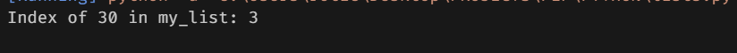

# Python List operations

## Tasks
1. Create an empty list called my_list.
2. Append the following elements to my_list: 10, 20, 30, 40.
3. Insert the value 15 at the second position in the list.
4. Extend my_list with another list: [50, 60, 70].
5. Remove the last element from my_list.
6. Sort my_list in ascending order.
7. Find and print the index of the value 30 in my_list.

## Steps

**1. Create an empty list called my_list.**

### Output
.

**2. Append the following elements to my_list: 10, 20, 30, 40.**

.

**3. Insert the value 15 at the second position in the list.**

.

**4. Extend my_list with another list: [50, 60, 70].**

.

**5. Remove the last element from my_list.**

.

**6. Sort my_list in ascending order.**

.

**7. Find and print the index of the value 30 in my_list.**

.

